# Hose Failure Dataset
**Table of Contents**

[TOCM]

[TOC]

## Dataset Description
This dataset was created specifically for the development of a real-time classifier using deep learning for image processing. The dataset contains images of failures in four types of hoses: SWAN, BICOLOR, GAS, and PRESION, captured from four [ARDUCAM IMX519](https://docs.arducam.com/Raspberry-Pi-Camera/Multi-Camera-CamArray/Multi-Camera-CamArray/ "ARDUCAM IMX519") cameras positioned at 90-degree intervals to analyze the perspective and integrity of the hoses in a 360-degree view. The images were collected at a resolution of 640x360 pixels.

The dataset currently has two versions: 1.0 and 2.0. Each version serves a different purpose  The dataset is organized according to the following directory structure:

```
.
├── 1.0
│   ├── 1-1
│   │   ├── GAS_0
│   │   ├── GAS_1
│   │   ├── SWAN_0
│   │   └── SWAN_1
│   ├── 2-1
│   │   ├── BACKGROUND
│   │   ├── GAS_0
│   │   ├── GAS_1
│   │   ├── SWAN_0
│   │   └── SWAN_1
│   └── 4-1
│       ├── BACKGROUND
│       ├── GAS_0
│       ├── GAS_1
│       ├── SWAN_0
│       └── SWAN_1
└── 2.0
    └── 2-1
        ├── GAS
        │   ├── BACKGROUND
        │   ├── FAILURE
        │   ├── GOOD
        │   └── WARNING
        └── SWAN
            ├── BACKGROUND
            ├── FAILURE
            ├── GOOD
            └── WARNING
```

### 1.0
Version 1.0 is designed for binary classification between good and faulty hoses of the four types, considering three different perspectives 1, 2 , and 4 cameras per image. The directory structure for version 1.0 is as follows:

#### Details of dataset:
- Image size: 640 x 360 pixels
- Color space: RGB
- Number of classes: 4 (Background - Gas_0 - Gas_1 - Swan_0 - Swan_1)
- Number of samples per class: 500

------------


- **1-1**: One camera per image.
  - **GAS_0**: Images of GAS hoses (failure).
  - **GAS_1**: Images of GAS hoses (no failure).
  - **SWAN_0**: Images of SWAN hoses (failure).
  - **SWAN_1**: Images of SWAN hoses (no failure).

------------


- **2-1**: Two cameras per image.
  - **BACKGROUND**: Background images.
  - **GAS_0**: Images of GAS hoses (failure).
  - **GAS_1**: Images of GAS hoses (no failure).
  - **SWAN_0**: Images of SWAN hoses (failure).
  - **SWAN_1**: Images of SWAN hoses (no failure).

------------


- **4-1**: Four cameras per image.
  - **BACKGROUND**: Background images.
  - **GAS_0**: Images of GAS hoses (failure).
  - **GAS_1**: Images of GAS hoses (no failure).
  - **SWAN_0**: Images of SWAN hoses (failure).
  - **SWAN_1**: Images of SWAN hoses (no failure).

### 2.0
#### Details of dataset:
- Image size: 640 x 360 pixels
- Color space: RGB
- Number of classes: 4 (Background-Failure-Good-Warning)
- Number of samples per class: 1000

------------


Version 2.0 of the dataset introduces additional categories and it focuses separately the failures for each type of hose. The directory structure for version 2.0 is as follows:

- **2-1**: Two cameras per image.
  - **GAS**:
    - **BACKGROUND**: Background images.
    - **FAILURE**: Images of failed GAS hoses.
    - **GOOD**: Images of good GAS hoses.
    - **WARNING**: Images of warning signs on GAS hoses.
  - **SWAN**:
    - **BACKGROUND**: Background images.
    - **FAILURE**: Images of failed SWAN hoses.
    - **GOOD**: Images of good SWAN hoses.
    - **WARNING**: Images of warning signs on SWAN hoses.


## Dataset Images Preview:
#### Version 1.0:
Here are preview images from each category, camera mode, and dataset version:
##### 1-1:
| GAS_0 | GAS_1 | SWAN_0 | SWAN_1 |
|:-:|:-:|:-:|:-:|
| 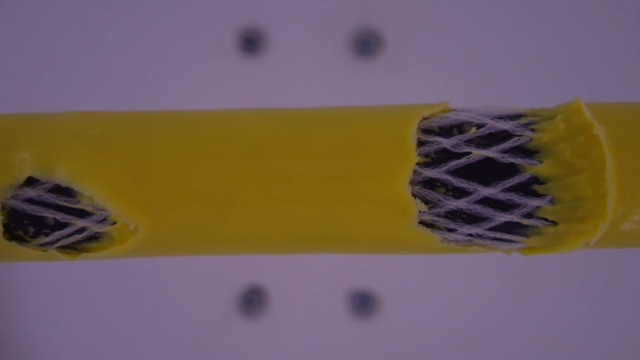 | 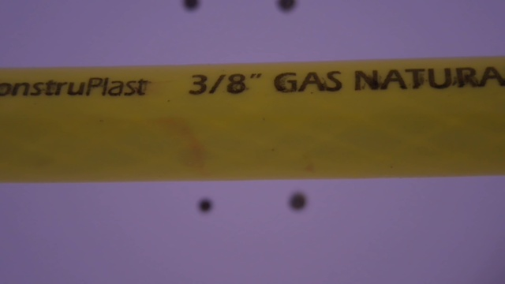 | 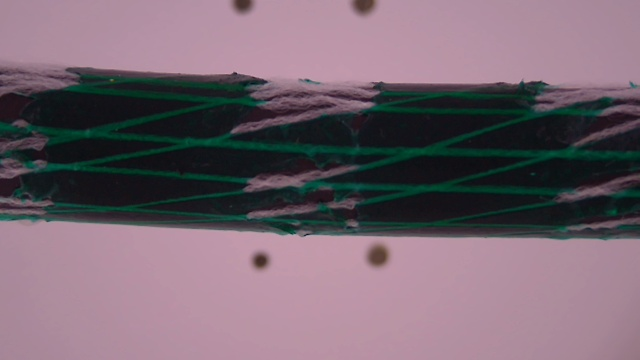 | 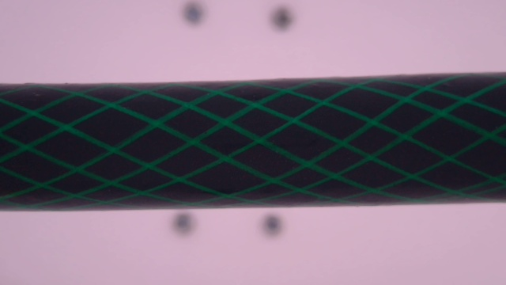 |

##### 2-1:
| BACKGROUND | GAS_0 | GAS_1 | SWAN_0 | SWAN_1 |
|:-:|:-:|:-:|:-:|:-:|
| 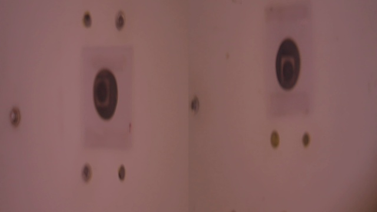 | 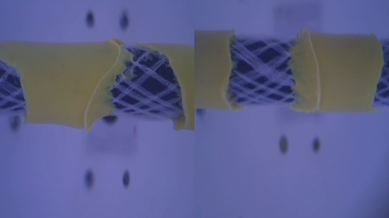 | 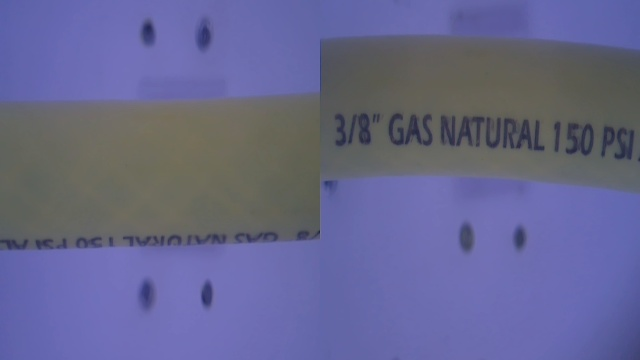 | 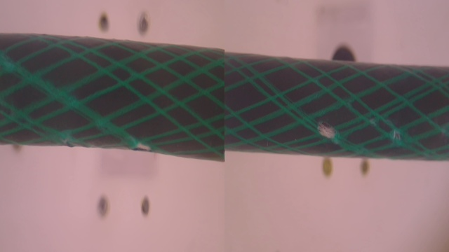 | 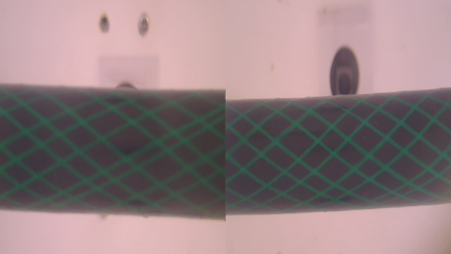 |

##### 4-1:
| BACKGROUND | GAS_0 | GAS_1 | SWAN_0 | SWAN_1 |
|:-:|:-:|:-:|:-:|:-:|
| 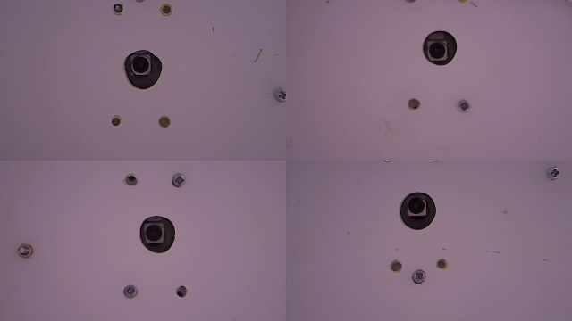 | 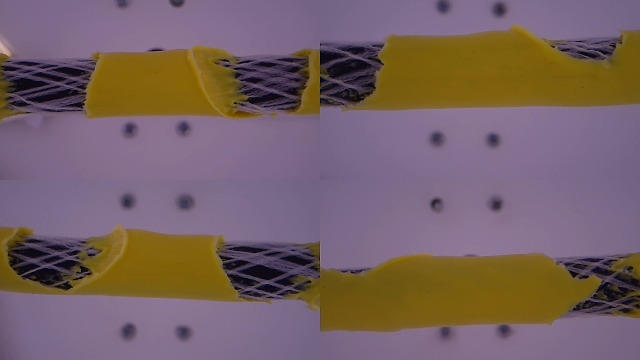 | 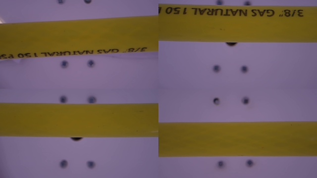 | 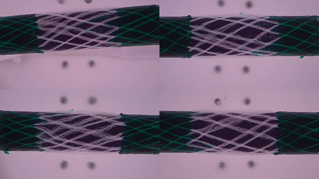 | 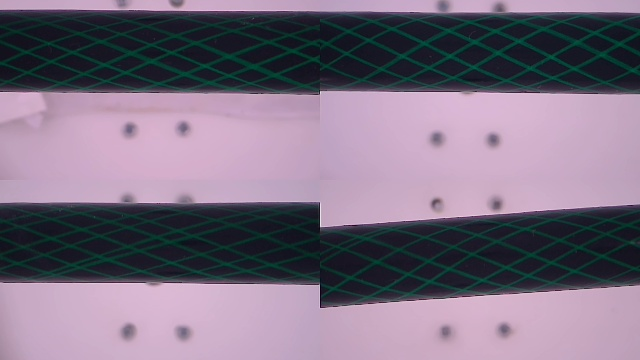 |

------------

#### Version 2.0:
##### 2-1/GAS:
| BACKGROUND | FAILURE | GOOD | WARNING |
|:-:|:-:|:-:|:-:|
| 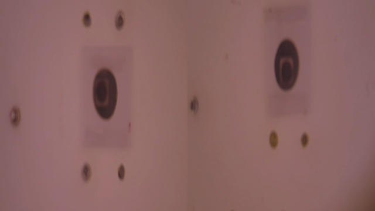 | 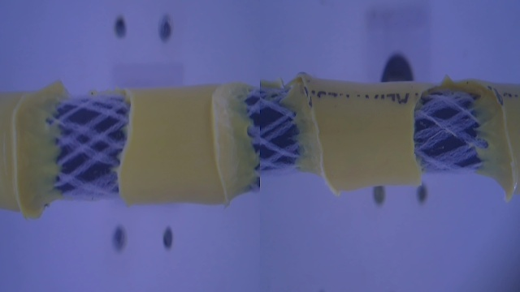 | 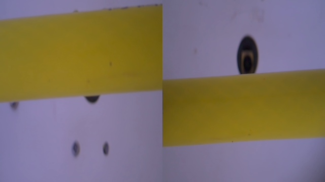 | 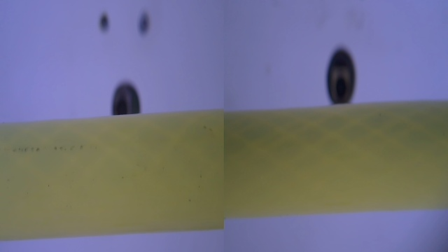 |

##### 2-1/SWAN:
| BACKGROUND | FAILURE | GOOD | WARNING |
|:-:|:-:|:-:|:-:|
|  | 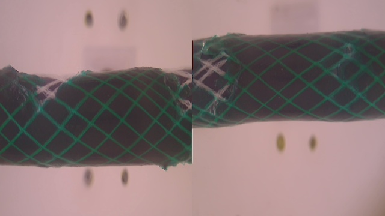 |  | 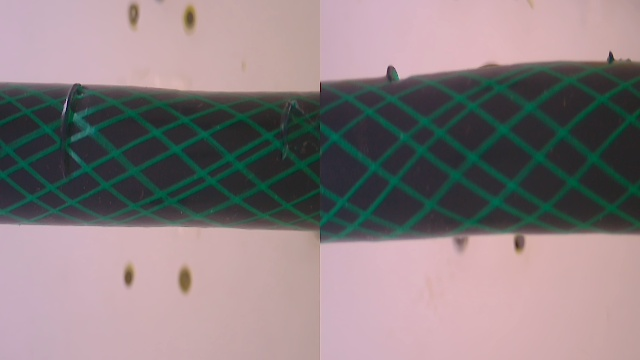 |


## Repository Link
The code and additional information for the classifier development project using this dataset can be found in the following repository: [Hose Failure Classifier](https://github.com/mhenaora/hose_failure_classifier)


